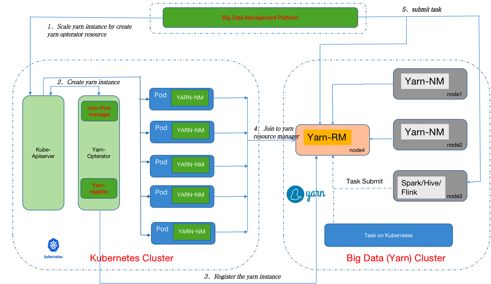

# Yarn-Operator
                                                                                      
This project provider an operator to manager yarn's node manager and resource manager. It support big data system smooth migrate to kuberenets.

## Features
* Automatically manager the yarn instance
* Automatically register the yarn instance to yarn resource manager

## Requirements

* Kubernetes 1.10.5+

## Installation
TODO

## Architecture

## Licensing

Apache License 2.0. See [LICENSE](LICENSE) for the full license text.                                                                                                         